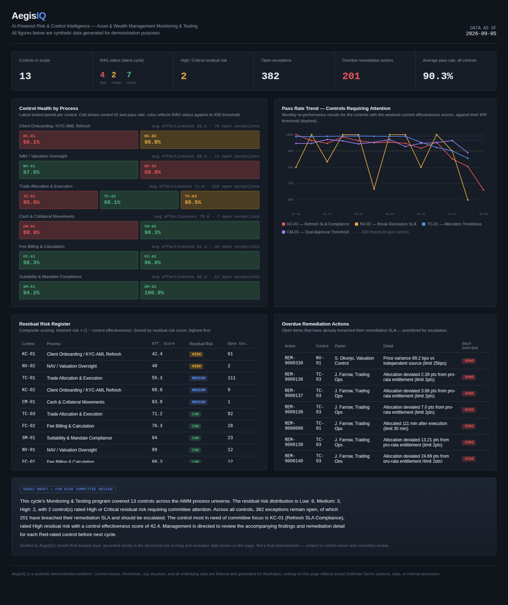
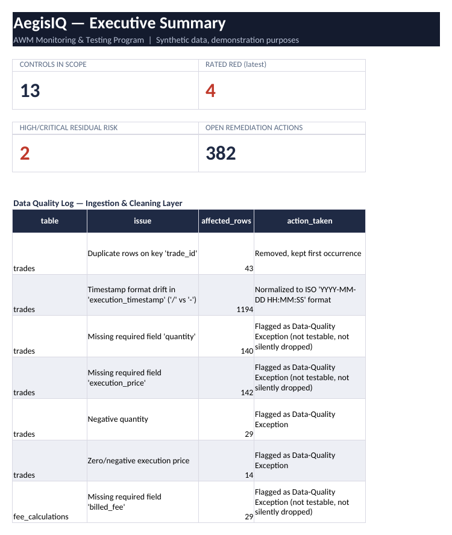
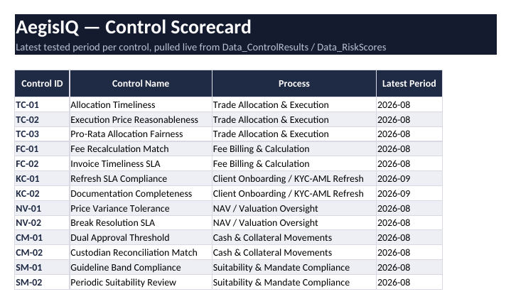

<div align="center">

# AegisIQ
### AI-Powered Risk & Control Intelligence Platform

**Asset & Wealth Management — Monitoring & Testing**


*An end-to-end control-testing, risk-scoring, and reporting platform — built to demonstrate how
a modern AWM Monitoring & Testing function can combine SQL, Python, ML, GenAI, Excel, and BI
into one governed pipeline.*

**⚠ All data is synthetic.** Control names, thresholds, and figures below are generated for
demonstration and do not reflect any real institution's systems or risk profile.

</div>

---

## Table of Contents

- [What this is](#what-this-is)
- [Results at a glance](#results-at-a-glance)
- [Dashboard preview](#dashboard-preview)
- [Excel workbook preview](#excel-workbook-preview)
- [Architecture](#architecture)
- [Project layout](#project-layout)
- [Quick start](#quick-start)
- [What the platform found — walkthrough by layer](#what-the-platform-found--walkthrough-by-layer)
- [Why each tool was used where it was](#why-each-tool-was-used-where-it-was)
- [Design decisions & scope](#design-decisions--scope)

---

## What this is

AegisIQ automates the core loop of an Asset & Wealth Management **Monitoring & Testing (M&T)**
function: test controls over the *entire* population (not a manual sample), score residual
risk consistently, catch drift before it becomes a breach, track remediation to closure, and
turn all of it into committee-ready reporting — with GenAI doing the first draft of the writing,
not the thinking.

Every result in this README came from actually running the pipeline end-to-end with a fixed
seed. Nothing here is illustrative pseudo-output — the numbers are reproducible.

<br>

<details>
<summary><b>▸ Why this matters for AWM M&T specifically (click to expand)</b></summary>
<br>

M&T teams recurringly test controls across trading, billing, KYC/AML, valuation, treasury, and
suitability — and every cycle involves the same repeated work: re-perform the test, compute the
pass rate, compare to threshold, investigate exceptions, hypothesize root cause, track
remediation, and write it all up for a committee. AegisIQ automates the mechanical parts of that
loop (100% test re-performance, scoring, drift detection, first-draft writing) while keeping
every judgment call — sign-off, escalation, final risk rating — with a human. See
[`docs/01_business_problem_and_architecture.md`](docs/01_business_problem_and_architecture.md)
for the full rationale, and [`docs/02_dataset_schema.md`](docs/02_dataset_schema.md) for exactly
what's in the synthetic dataset and why.

</details>

---

## Results at a glance

| Metric | Result |
|---|---|
| Controls tested | **13**, across 6 AWM processes |
| Population tested | **100%** of ~29,600 synthetic transactions (not a manual sample) |
| Control × period test results | 147 |
| Exceptions identified | 2,271 (with reason codes — none silently dropped) |
| Remediation actions closed / still open | 1,889 closed · **382 open** |
| Overdue vs. remediation SLA | **201** — the single most actionable number in the platform |
| Residual risk distribution | 8 Low · 3 Medium · **2 High** · 0 Critical |
| Planted anomalies correctly detected by ML | **3 / 3** |
| Pipeline validation checks passing | **25 / 25** ✅ |
| Excel formulas / recalculation errors | 307 formulas / **0 errors** |
| GenAI drafts passing grounding check | **7 / 7**, zero unresolved flags |

---

## Dashboard preview

<div align="center">

</div>

A single self-contained HTML file — no server, no dependencies — opens directly in any browser.
KPI instrument strip, per-process control heatmap, KRI trend chart, residual risk register,
overdue remediation actions, and a GenAI-drafted executive narrative, all on one page.

▶ **[Open the live dashboard](dashboards/executive_dashboard.html)**

---

## Excel workbook preview

<table>
<tr>
<td width="50%" valign="top">

<p align="center"><i>Exec Summary — live KPI tiles, zero hardcoded numbers</i></p>
</td>
<td width="50%" valign="top">

<p align="center"><i>Control Scorecard — banded table, conditional RAG formatting</i></p>
</td>
</tr>
</table>

Every summary number is a live `SUMIFS` / `COUNTIFS` / `INDEX-MATCH` formula against the raw
`Data_*` sheets — refresh the data sheets and the whole workbook recalculates. Built and
recalculation-tested with **0 formula errors across 307 formulas**.

▶ **[Open the workbook](outputs/AegisIQ_Executive_Report.xlsx)**

---

## Architecture

```
Synthetic source data (6 AWM processes, ~29,600 rows, 12 monthly cycles)
        │
Layer 1   Ingestion & Cleaning (Python/pandas)          → auditable data-quality log
Layer 2   SQL Analytics / KRI-KCI-KPI views (SQLite)     → reproducible metric definitions
Layer 3   Automated Control Testing (rules-as-code)      → 100%-population pass/fail + exceptions
Layer 4   Composite Risk Scoring                         → inherent risk × control effectiveness
Layer 5   ML Anomaly Detection (z-score + IsolationForest) → drift flags ahead of hard breaches
Layer 6   GenAI Risk Analyst (Claude API, grounded)      → findings, root cause, remediation, MI
Layer 7   Remediation Workflow & Tracking                → owned, dated, SLA-tracked actions
Layer 8   Reporting — Excel workbook + BI dashboard      → two audiences, two formats
```

<details>
<summary><b>▸ Full layer-by-layer rationale (click to expand)</b></summary>
<br>

See [`docs/01_business_problem_and_architecture.md`](docs/01_business_problem_and_architecture.md)
for the complete design rationale — why each layer exists, what it automates, and what it
deliberately leaves to a human reviewer.

</details>

---

## Project layout

```
aegisiq/
├── docs/
│   ├── 01_business_problem_and_architecture.md
│   ├── 02_dataset_schema.md
│   └── assets/                    (README screenshots)
├── data/
│   ├── raw/                       (synthetic source extracts, 8 CSVs)
│   └── processed/                 (cleaned tables, SQLite db, fact tables)
├── sql/
│   └── analytics_views.sql
├── src/
│   ├── ingestion/                 generate_data.py, etl.py
│   ├── controls/                  control_testing.py, remediation.py
│   ├── risk_scoring/              risk_score.py
│   ├── ml_anomaly/                anomaly_detection.py
│   ├── genai/                     genai_risk_analyst.py
│   └── reporting/                 generate_excel_report.py
├── dashboards/
│   ├── executive_dashboard.html
│   └── dashboard_data.json
├── outputs/
│   ├── AegisIQ_Executive_Report.xlsx
│   └── genai_findings_report.md
└── tests/
    └── validate_pipeline.py
```

---

## Quick start

```bash
cd src/ingestion   && python generate_data.py --outdir ../../data/raw --seed 42
cd ../ingestion    && python etl.py
cd ../controls     && python control_testing.py && python remediation.py
cd ../risk_scoring && python risk_score.py
cd ../ml_anomaly   && python anomaly_detection.py
cd ../genai        && python genai_risk_analyst.py     # set ANTHROPIC_API_KEY for live GenAI
cd ../reporting    && python generate_excel_report.py
cd ../../tests     && python validate_pipeline.py       # exits non-zero if anything's broken
```

Each stage reads the previous stage's output from `data/processed/` — fully sequential and
reproducible from a fixed seed. `tests/validate_pipeline.py` is the single command that proves
the whole thing still works end-to-end.

---

## What the platform found — walkthrough by layer

<details open>
<summary><b>Layer 3 — Automated Control Testing</b></summary>
<br>

13 controls tested over **100% of the population** (not a 20–30 item manual sample) across 12
monthly cycles: **2,271 exceptions** identified with reason codes, and every data-quality issue
(nulls, duplicates, out-of-range values, a source-system timestamp format change) was separately
flagged rather than conflated with a real control failure.

</details>

<details>
<summary><b>Layer 7 — Remediation Workflow</b></summary>
<br>

Of 2,271 exceptions, **1,889 have since closed**; **382 remain open**, of which **201 are already
overdue** against their remediation SLA. This is the number that belongs on page one of any
committee pack.

</details>

<details>
<summary><b>Layer 4 — Composite Risk Scoring</b></summary>
<br>

Residual risk distribution: **8 Low / 3 Medium / 2 High / 0 Critical**. The two controls most
needing committee attention — surfaced automatically, not pre-flagged by a human — are:

| Control | Name | Effectiveness | Residual Risk |
|---|---|---|---|
| **KC-01** | KYC Refresh SLA Compliance | 42.4 (Ineffective) | **High** |
| **NV-02** | Pricing Break Resolution SLA | 48.0 (Ineffective) | **High** |

</details>

<details>
<summary><b>Layer 5 — ML Anomaly Detection</b></summary>
<br>

Correctly detected **all three** deliberately planted anomalies in the synthetic data:

| Control | Planted issue | Detection method | Result |
|---|---|---|---|
| TC-01 | Gradual allocation-timeliness drift | Isolation Forest (multivariate drift) | Flagged ahead of the eventual Red threshold breach |
| FC-01 | Feb-2026 fee-mismatch step-change spike | Rolling z-score | Flagged specifically in that period |
| KC-01 | Progressive KYC backlog growth | Isolation Forest | Flagged across the growth window |

This is the core value case for ML here: a static threshold only catches #2 promptly — #1 and #3
are slow drifts a threshold-only system would miss for months.

</details>

<details>
<summary><b>Layer 6 — GenAI Risk Analyst</b></summary>
<br>

Drafted an executive narrative plus findings/root-cause/remediation text for the 6 highest-risk
controls (see [`outputs/genai_findings_report.md`](outputs/genai_findings_report.md)). Every
draft passed a post-hoc **grounding check** — every numeric claim in the generated text is
verified against the structured pipeline output it was given, so nothing is invented. The same
code path calls the live Anthropic Messages API when `ANTHROPIC_API_KEY` is configured, and falls
back to a deterministic template built from the identical grounded data package when it isn't —
so behavior stays consistent and testable in any environment.

</details>

<details>
<summary><b>Stage 8 — Validation</b></summary>
<br>

`tests/validate_pipeline.py` — **25/25 checks passed**, including structural integrity checks
and "does it actually find what we planted" checks against the three known-answer anomalies
above. This is what makes the platform's claims checkable rather than asserted.

</details>

---

## Why each tool was used where it was

| Tool | Used for | Deliberately *not* used for |
|---|---|---|
| **Python / pandas** | ETL, control testing, scoring, ML | — |
| **SQL (SQLite)** | Auditable, re-runnable KRI/KPI metric definitions | Procedural logic (that's Python's job) |
| **Excel** | Control-owner-facing detail workbook, live formulas | Committee-level overview (that's the dashboard) |
| **ML — z-score + Isolation Forest** | Drift/step-change detection on ~12-point monthly series | Deep learning / LSTM — rejected on purpose: nowhere near enough data per control to train or validate a sequence model responsibly |
| **GenAI** | Drafting findings/root-cause/remediation/narrative from structured data, with a grounding check | Free-form chat, or as a source of facts not already in the pipeline's own output |

---
